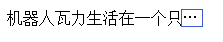
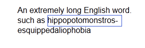

# 做吊炸天的网站

## [外链标识](http://htmlpreview.github.io/?https://github.com/iamjoel/make-cool-site/blob/master/external-link/index.html)
在文章内的会跳出本站的链接要有小图标进行标识出来。    

## [文字选中](http://htmlpreview.github.io/?https://github.com/iamjoel/make-cool-site/blob/master/text-selected/text-selected.html)
文字选中时，可设置与网站主题相符合的颜色。    

## [溢出文字加省略号]()

## [英文单词换行自动加连词符号(-)]()
兼容性：Firfox6+, Safari5.1+,IE 10+。chrome不支持    

## [导航滚动至锚点位置](http://htmlpreview.github.io/?https://github.com/iamjoel/make-cool-site/blob/master/nav-scroll-anim/index.html)
1. 可以使用自定义的滚动效果
1. 对当前的锚点位置可做一些修饰
