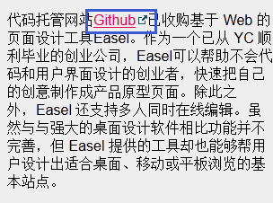

# 做吊炸天的网站

## [外链标识](http://htmlpreview.github.io/?https://github.com/iamjoel/make-cool-site/blob/master/external-link/index.html)
在文章内的会跳出本站的链接要有小图标进行标识出来。    

## [文字选中](http://htmlpreview.github.io/?https://github.com/iamjoel/make-cool-site/blob/master/text-selected/text-selected.html)
文字选中时，可设置与网站主题相符合的颜色。    

## [溢出文字自动加省略号](http://htmlpreview.github.io/?https://github.com/iamjoel/make-cool-site/blob/master/text-overflow/index.html)

## [英文单词换行自动加连词符号(-)](http://htmlpreview.github.io/?https://github.com/iamjoel/make-cool-site/blob/master/en-word-break/index.html)
兼容性：Firfox6+, Safari5.1+,IE 10+。chrome不支持    

## 页面很长
1. [返回顶部按钮](http://htmlpreview.github.io/?https://github.com/iamjoel/make-cool-site/blob/master/scroll-to-top/index.html)
1. 导航滚动时能固定
例如 http://www.36kr.com/

## [导航滚动至锚点位置](http://htmlpreview.github.io/?https://github.com/iamjoel/make-cool-site/blob/master/nav-scroll-anim/index.html)
1. 可以使用自定义的滚动效果
1. 对当前的锚点位置可做一些修饰

## [自定义的hover提示文字](http://htmlpreview.github.io/?https://github.com/iamjoel/make-cool-site/blob/master/tool-tip/index.html)
默认是靠title属性。但有时，我们需要定制化外观和更快的相应时间。

## [图片的hover反馈效果](http://htmlpreview.github.io/?https://github.com/iamjoel/make-cool-site/blob/master/img-hover/index.html)
hover图片时，增加图片变暗的效果
模仿 http://www.lonelyplanet.com/france/paris

## 尽量使用单列而不是多列布局
单列布局能够让对全局有更好的掌控。同时用户也可以一目了然内容。而多列而已则会有分散用户注意力的风险使你的主旨无法很好表达。最好的做法是用一个有逻辑的叙述来引导用户并且在文末给出你的操作按钮。

## 合并页面上重复的功能而使界面简洁
在整个产品开发期间我们会有意无意地创建很多模块，版面或者元素，而它们的功能可能有些是重叠的。此种情况表明界面已经过度设计了。时刻警惕这些冗余的功能模块，它无用且降低了电脑性能。此外，界面上模块越多，用户的学习成本就越大。所以请考虑重构你的界面使它足够精简。

## 行动按钮一般要以一个动词开始，否则他就不是一个召唤行为的按钮。 --David Hamill

## 一些交互定律
### [菲茨定律](http://zh.wikipedia.org/zh/%E8%B4%B9%E8%8C%A8%E6%B3%95%E5%88%99)
* 按钮等可点击对象需要合理的大小尺寸
* 屏幕的边和角很适合放置像菜单栏和按钮这样的元素，因为边角是巨大的目标，它们无限高或无限宽，你不可能用鼠标超过它们。即不管你移动了多远，鼠标最终会停在屏幕的边缘，并定位到按钮或菜单的上面
* 出现在用户正在操作的对象旁边的控制菜单（右键菜单）比下拉菜单或工具栏可以被打开得更快，因为不需要移动到屏幕的其他位置

### Hick's Law / 席克定律（希克法则）
一个人面临的选择（n）越多，所需要作出决定的时间（T）就越长

### 神奇数字 7±2 法则
人类头脑最好的状态能记忆含有7（±2）项信息块，在记忆了 5-9 。项信息后人类的头脑就开始出错。与席克定律类似，神奇数字 7±2 法则也经常被应用在移动应用交互设计上，如应用的选项卡不会超过 5 个

### 接近法则
当对象离得太近的时候，意识会认为它们是相关的。

### 泰思勒定律（复杂性守恒定律）
该定律认为每一个过程都有其固有的复杂性，存在一个临界点，超过了这个点过程就不能再简化了，你只能将固有的复杂性从一个地方移动到另外一个地方。如对于邮箱的设计，收件人地址是不能再简化的，而对于发件人却可以通过客户端的集成来转移它的复杂性。

### 新乡重夫：防错原则
防错原则认为大部分的意外都是由设计的疏忽，而不是人为操作疏忽。通过改变设计可以把过失降到最低。该原则最初是用于工业管理的，但在交互设计也十分适用。如在硬件设计上的 USB 插槽；而在界面交互设计中也是可以经常看到，如当使用条件没有满足时，常常通过使功能失效来表示（一般按钮会变为灰色无法点击），以避免勿按。

### 奥卡姆剃刀原理（简单有效原理）
这个原理被称为“如无必要，勿增实体”，即如有两个功能相等的设计，那么选择最简单的

### 古腾堡法则
古腾堡法则指人们在浏览页面的时候，视觉都趋向于从上到下，从左到右的眼动规律。左上角是视觉的第一落点区，而右下角是视觉最终落点区。用户的视觉中心往往在页面的左上方，而结束浏览时视线往往落在右下角，所以合理利用这个法则可以帮助用户更好地获取内容并采取行动。 右上角和左下角往往是视觉盲区。

## 关于动画设计的准则
* [CSS动画指南：规则与实例](http://zhubo.tumblr.com/css3-animation-in-12-principles)
* [12 basic principles of animation](http://en.wikipedia.org/wiki/12_basic_principles_of_animation)
* [motion-ui-design-principles](http://www.beyondkinetic.com/motion-ui-design-principles/)
* [google的Material Design设计规范](http://www.google.com/design/spec/animation/authentic-motion.html)

## 更多资料
* [好的用户界面-界面设计的一些技巧](http://www.cnblogs.com/Wayou/p/goodui.html) 翻译自 [goodui](http://goodui.org/)
* [交互设计七大定律](http://www.geekpark.net/topics/166489)
* [写给产品经理和设计师的用户体验知识1](http://zhuanlan.zhihu.com/uxcafe/19939046)
* [写给产品经理和设计师的用户体验知识2](http://zhuanlan.zhihu.com/uxcafe/19948155)

